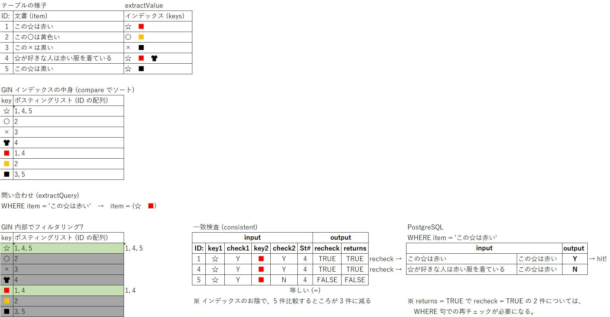

# pg_bigm

[pgbigm/pg_bigm: The pg_bigm module provides full text search capability in PostgreSQL. This module allows a user to create 2-gram (bigram) index for faster full text search.](https://github.com/pgbigm/pg_bigm) を、PostgreSQL 9.6 - 17.0 Windows 版で楽しめるように助力いたします。 自炊方法については build.md を参照。

## インストール方法

[Releases](https://github.com/HiraokaHyperTools/pg_bigm/releases/) から `20250925.7z` をダウンロードして展開します。

PostgreSQL 17.x Windows x86-64 の場合:

`pg_bigm-postgresql-17.0-x64` フォルダーの中身を `C:\Program Files\PostgreSQL\17` へコピー

pg_bigm は、データベースごとにインストールしてください。

対象のデータベースで SQL 文を実行:

```sql
CREATE EXTENSION pg_bigm;
```

いまくいけば、これで完了です。

## 使用例

[sql/pg_bigm_ja.sql](sql/pg_bigm_ja.sql) を参照してください。 実例が記載されています。

## インデックス作成方法

```sql
-- tests for creation of full-text search index
CREATE TABLE test_bigm (col1 text, col2 text);
CREATE INDEX test_bigm_idx ON test_bigm USING gin (col1 gin_bigm_ops);
```

## 検索方法 (部分一致)

```sql
SELECT col1 FROM test_bigm WHERE col1 LIKE likequery('東京都');
```

## 高速化の原理

`pg_bigm` は [64.4. GINインデックス](https://www.postgresql.jp/document/17/html/gin.html) を実装します。 (逆にいうと GIN 以外の B-Tree, GiST, BRIN, ハッシュインデックス等は実装しません)

インデックスの対象物は、バイグラムです。

バイグラムとは、 2 文字からなる文字列の事です。例: `ai`, `文字`, `👋😀`

UTF-8 エンコード使用時は、 UTF-32 の文字数と同じです。

参考:

| 文字 | UTF-16 | UTF-32 |
|---|---|---|
| `ai` | `U+0061` `U+0069` | `U+00061` `U+00069` |
| `文字` | `U+6587` `U+5B57` | `U+06587` `U+05B57` |
| `👋😀` | `U+D83D` `U+DC4B` `U+D83D` `U+DE00` | `U+1F44B` `U+1F600` |

これらのバイグラム群を、汎用転置インデックス (Generalized Inverted Index) へ保存する事で、高速に検索できるようにするのが pg_bigm です。

わかりにくいですか。 本の巻末索引を思い出してください。 辞書順 (あ ～ ん) に並べた単語と、ページ番号一覧の組み合わせが付録されていると思います。 これが GIN (汎用転置インデックス) の一例です。

但し、 PostgreSQL の GIN の場合はもう少し複雑です。 `りんご` で検索する場合は [`りん`, `んご`] の両方のバイグラムが含まれるレコードの一覧を取得しなくてはなりません。

[`りん`, `んご`] の両バイグラムが含まれているからといって `りんご` という単語が含まれている可能性は 100% ではありません。 [`りんかい`, `たんご`] のバイグラムにヒットした可能性もあります。 そういう場合は実際にデータを検査して、真偽確認をする必要があります。 つまり、ストレージからレコードを読み取ったうえで `りんご` という単語が本当に含まれているかどうかの最終確認が必要になります。 この処理のことを recheck 処理といいます。

この recheck の有無は、アクセスメソッド実装 (pg_bigm など) が GIN に対して都度指示ができます。 pg_bigm では、検索したいユニークなバイグラム数が 2 以上の場合は true になり、1 の場合は false になります。 ([bigm_gin.c](bigm_gin.c) の `gin_extract_query_bigm` を参照)

この recheck 動作を強制的に Off にできる `pg_bigm.enable_recheck` パラメータはありますが、検索結果が不正確になります。 操作しない方が良いでしょう。

図解すると、このようです:



こういった重そうなインデックス機能を使用したとしても、テーブル全体のシーケンシャルスキャンと比較して、高速 (検索時間の短縮) になるケースが感覚的には多いです。

## キーワード検索への応用

検索が複数列にわたる場合、複数のインデックスを作成しがちです。 しかし pg_bigm では複数列のインデックスを検索すると、かなりパフォーマンスが低下する傾向があります。

あるいは、文字列を一定のルールで正規化 (ひらがな、半角英数字に変換) したいというニーズもよくあります。例: `バイグラムＢｉＧｒａｍ` → `ばいぐらむbigram`

そこで、対象列を 1 つに合体するという方法が有効です。

`col1||' '||col2` では NULL を含むケースでは NULL に変換されてしまいます。

`coalesce(col1, '')||' '||coalesce(col2, '')` にすることで NULL 化を回避します。

正規化の例として、全体に `lower()` を適用します: `lower(coalesce(col1, '')||' '||coalesce(col2, ''))`

[CREATE INDEX](https://www.postgresql.jp/document/17/html/sql-createindex.html) で説明されているように、式に関数を使用する場合には制約があります。

> インデックスの定義で使用される全ての関数と演算子は、「不変」（immutable）でなければなりません。 つまり、結果は入力引数にのみに依存し、（他のテーブルの内容や現時刻などの）外部からの影響を受けてはなりません。 この制限によって、インデックスの動作が十分定義されていることが保証されます。 インデックス式やWHERE句にユーザ定義の関数を使用する場合、関数を作成する際、IMMUTABLE（不変）オプションを付けることを忘れないでください。

`lower()` など `IMMUTABLE` 属性の関数を使用する分には問題ありませんが、 自作の関数を使用する場合には注意が必要です。

インデックスの生存期間中に、変換ルールが変化しないように注意する必要があります。

もし変化してしまった場合は、 [REINDEX](https://www.postgresql.jp/document/17/html/sql-reindex.html) を手動で呼び出すなどして、インデックスの再構築をしましょう。

利用例です。

テーブルとインデックスを作成:

```sql
-- tests for creation of full-text search index
CREATE TABLE test_bigm (col1 text, col2 text);
CREATE INDEX test_bigm_idx ON test_bigm USING gin (lower(coalesce(col1, '')||' '||coalesce(col2, '')) gin_bigm_ops);
```

部分一致で検索。 `CREATE INDEX` で指定した式と、同じ式を `WHERE` 句へ記述します:

```sql
EXPLAIN SELECT col1 FROM test_bigm WHERE lower(coalesce(col1, '')||' '||coalesce(col2, '')) LIKE likequery(lower('東京都'));
```

EXPLAIN を使用。 インデックスが検索時に適用されている事 (`Bitmap Heap Scan` の使用) が確認できます:

```
QUERY PLAN
Bitmap Heap Scan on test_bigm  (cost=12.00..16.02 rows=1 width=32)
  Recheck Cond: (lower(((COALESCE(col1, ''::text) || ' '::text) || COALESCE(col2, ''::text))) ~~ '%東京都%'::text)
  ->  Bitmap Index Scan on test_bigm_idx  (cost=0.00..12.00 rows=1 width=0)
        Index Cond: (lower(((COALESCE(col1, ''::text) || ' '::text) || COALESCE(col2, ''::text))) ~~ '%東京都%'::text)
```
